# 1. Tổng quan về Stored Procedure
## Khái niệm 
Trong Mysql Procedure có nghĩ gần như là một hàm trong ngôn ngữ c để thực hiện những dòng lệnh liên quan ở trong đó
## Ưu điểm của Stored Procedure
- sử dụng Procedure để tăng hiệu xuất xử lý của ứng dụng
- Các thủ tục được lưu trong DB
- Stored Procedure giúp giảm thời gian giao tiếp giữa các ứng dụng với hệ quản trị MYSQL
- Mỗi thủ tục sẽ có các mức độ truy cập
## Nhược điểm của Stored Procedure
- Nếu bạn tạo ra quá nhiều Procedure thì hệ quản trị sẽ sử dụng bộ nhớ để lưu trữ các thủ tục này khá nhiều. 
- Ngoài ra nếu bạn thực hiện quá nhiều xử lý trong mỗi thủ tục thì đồng nghĩa với việc CPU sẽ làm việc nặng 
- Nếu sử dụng thủ tục thì sẽ rất khó phát triển trong ứng dụng, gây khó khăn ở mức logic business.
# 2. Cú pháp của  Stored Procedure
```
DELIMITER $$
CREATE PROCEDURE procedureName()
BEGIN
   /*Xu ly*/
END; $$
DELIMITER ;
```

Trong đó : 
- `DELIMITER $$` : Dùng để phân cách bộ nhớ lưu trữ thủ tục cache và mở ra một ô lưu trữ mới. Đây là cú pháp bắt buộc
- `CREATE PROCEDURE` : Dùng để khai báo tạo một procedure mới 
- `procedureName()` : tên của procedure 
- `BEGIN` và `END; $$` Dùng để khai báo bắt đầu của  procedure và kết thúc Procedure. Bên trong nó là một chuỗi lệnh để thực thi
- `DELIMITER ;` : Đóng lại ô lưu trữ
- Có thể kiểm tra các procedure đã được tạo ra
```
show procedure status;
```
- Sau khi tạo xong thì chúng ta có thể sử dụng nó bằng cú pháp sau
```
call procedureName();
```
Ví dụ ta sẽ tạo ra một procedure đê truy xuất dữ liệu từ bảng nhân viên trong DB quản lý.

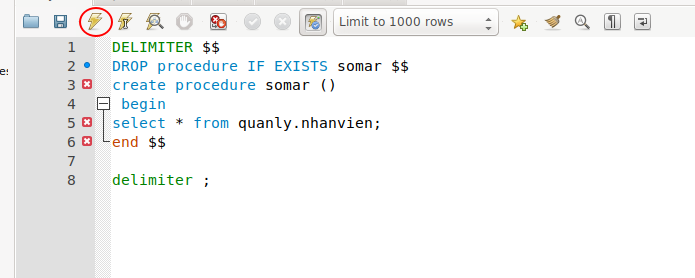

Và kết quả sau khi gọi hàm procedure là nó sẽ hiển thị tất cả dữ liệu bảng nhân viên 

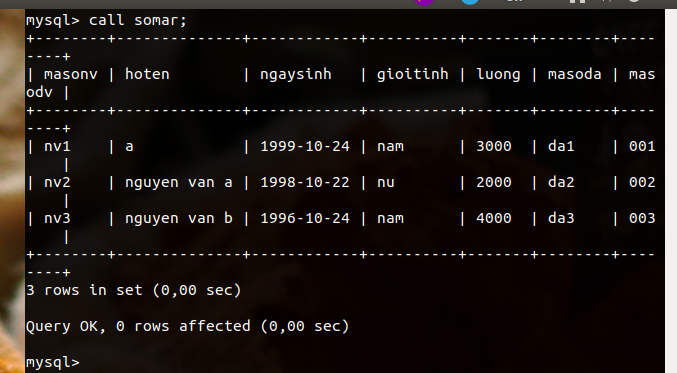

# 3. Biến trong Stored Procedure
Trong hàm procedure thì nó không chỉ có tác dụng truy vấn dữ liệu mà trong nó cũng có cả các biến và một số thuật toán. Đây là biến trong hàm

Cú pháp 
```
DECLARE variable_name datatype(size) DEFAULT default_value
```
Trong đó: 
- `DECLARE` : là từ khóa tạo biến
- `variable_name` : là tên biến
- `datatype(size)` : là kiểu dữ liệu của biến và kích thước của nó
- `DEFAULT default_value` : là gán giá trị mặc định cho biến

ví dụ tạo ra một procedure có 1 biến và in ra biến đó bằng cách gọi hàm 

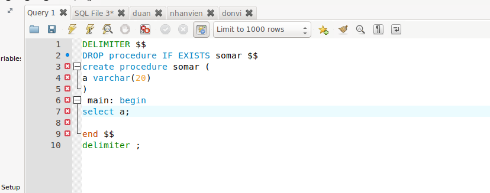

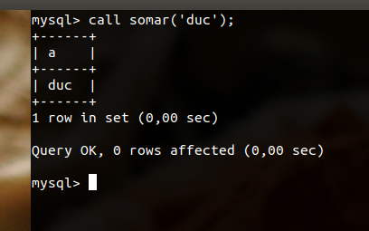

# 4. Truyền tham số trong Procedure
Cũng như tham số trong ngôn ngữ `C` thì tham số trong Procedure cũng có thể chuyền được giá trị vào, và cũng có kiểu dữ liệu của riêng nó.

Ví dụ ta tạo ra một procedure có khai báo tham số và truyền tham số cho nó và ảnh dưới là kết quả khi ta gọi procedure đó ra.

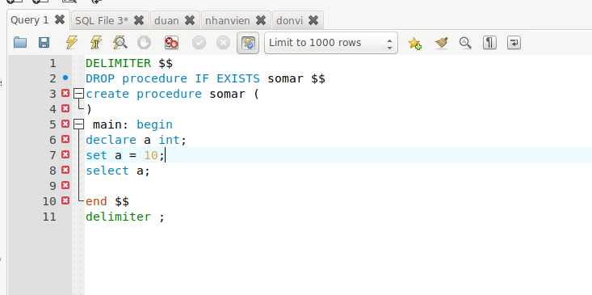

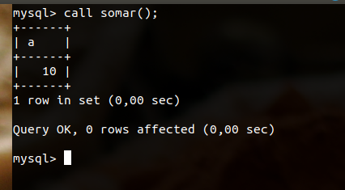

# 5. Câu lệnh if else trong Procedure
Cú pháp 
```
IF điều kiện THEN
    câu lệnh
   ELSEIF điều kiện THEN
    câu lệnh 
   ELSE
    câu lệnh 
END IF;
```

Ví dụ tạo một procedure đơn giản để nói về lệnh if đó là ta tạo ra một biến a nếu biến đó là 1 thì in ra màn hình là `điều kiện đúng` nếu không phải thì in ra màn hình là `điều kiện sai`

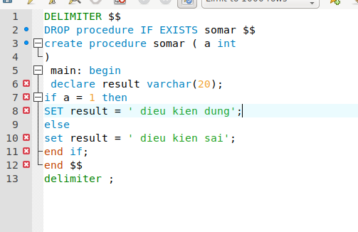

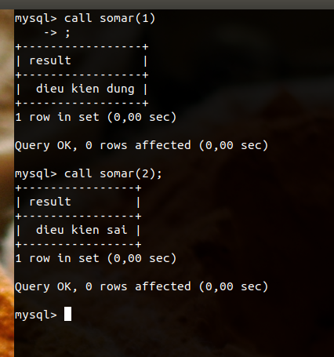

# 6. câu lệnh case trong Procedure
Cú pháp 
```
CASE  case_expression
   WHEN điều kiện1 THEN câu lệnh
   WHEN điều kiện2 THEN câu lệnh
   ...
   ELSE câu lệnh
END CASE;
```

Dưới đây là một ví dụ nhỏ về case trong procedure 

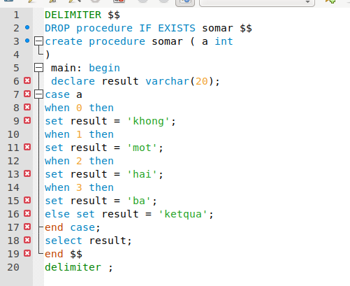

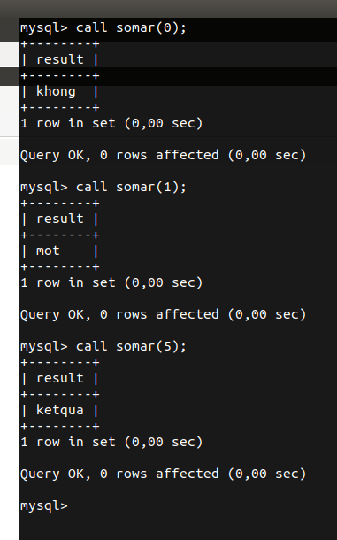

# 7. Vòng lặp while 
Cú pháp 
```
WHILE điều kiện DO
   các câu lệnh
END WHILE;
```

Ví dụ đơn giản về vòng lặp. Ta sẽ tạo ra 2 biến a và b và in tất cả các số nguyên từ (a, b)

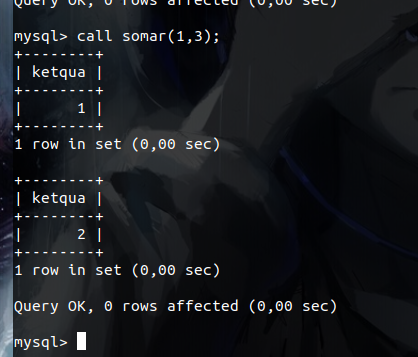


# link tham khảo 

https://freetuts.net/tao-mysql-stored-procedure-dau-tien-279.html

