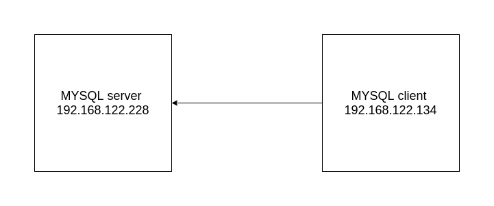
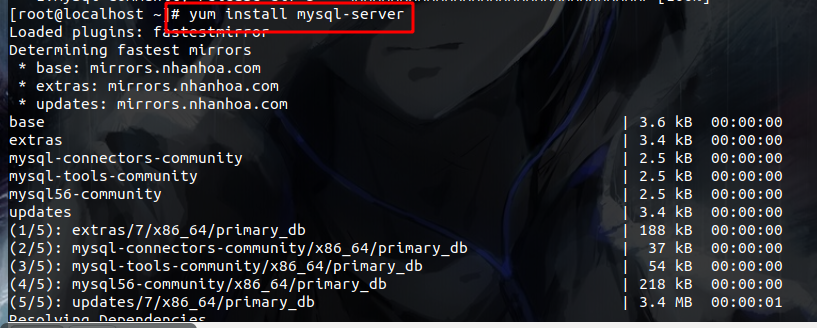
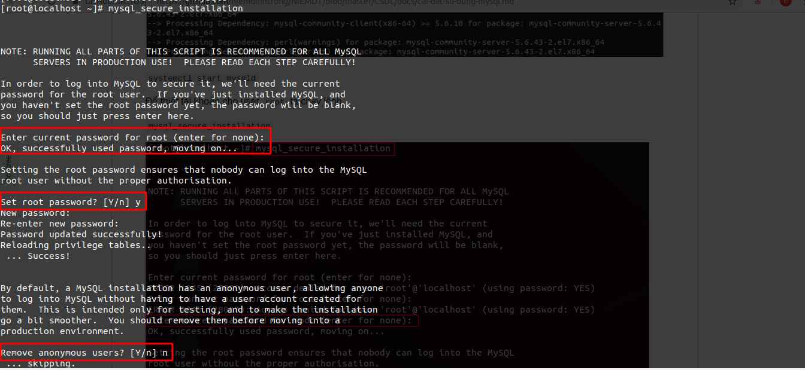
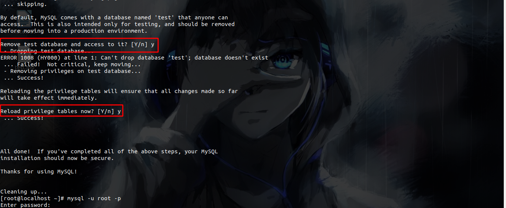

Trong RDBMS thì có hai loại chính được sử dụng 
# 1.Hệ quản trị CSDL quan hệ có cấu trúc(MYSQL)
SQL chính là viết tắt của Structured Query language. Một cơ sở dữ liệu quan hệ xác định các mối quan hệ dưới dạng các bảng. Cơ sở quan hệ dữ liệu có cấu trúc :  MySQL, Oracle, MS SQL Server, Sybase,....
# 2. Hệ quản trị CSDL  quan hệ phi cấu trúc(NOSQL)
NoSQL là một DMS phi quan hệ, không yêu cầu một lược đồ cố định, tránh các phép nối, và dễ dàng mở rộng. Cơ sở dữ liệu NoSQL được sử dụng cho các kho dữ liệu phân tán với nhu cầu lưu trữ dữ liệu khổng lồ. Mongdb; NOSQL.....

# So sánh SQL và NOSQL 
| Nội dung    |      SQL           |         NOSQL          |
| ----- |-----|------|
| Lịch sử| Được phát triển năm 1970 | Được phát triển vào những năm 2000 để giải quyết các hạn chế của cơ sở dữ liệu SQL|
|Định nghĩa  | Cơ sở dữ liệu quan hệ có cấu trúc | cơ sở dữ liệu quan hệ phi cấu trúc |
|Kiểu lưu dữ liệu | Cơ sở dữ liệu dưa trên dạng bảng | dữ liệu có thể dựa trên tài liệu, cặp khóa-giá trị, cơ sở dữ liệu biểu đồ|
|Lược đồ|   Được xác định trước |   Không được xác định trước|
|Khả năng mở rộng| Theo chiều dọc | Theo chiều ngang |
|Phù hợp| Môi trường truy vấn phức tạp| Môi trường truy vấn đơn giản |
| Khả năng mở rộng | Máy chủ duy nhất dung lượng phải lớn lên có thể làm trên nhiều máy chủ nhưng cần phải cài đặt nhiều thứ | Có thể phát triển trên nhiều máy chủ| 
| Thao tác dữ liệu| Sử dụng câu lệnh | Thông qua các API |
| Mô hình phát triển | Kết hợp giữa mã nguồn mở và mã nguồn đóng | Mã nguồn mở |
| lược đồ | Cấu trúc dữ liệu được định sẵn | Các bản ghi có thể thêm thông tin mới một các dễ dàng |
| Tính nhất quán | Tính nhất quán rõ ràng | không có |

MYSQL , MSSQL, MARIADB  thuộc loại hệ quản trị cơ sở dữ liệu nào? 

Cả 3 đều thuộc một dạng quan hệ có cấu trúc.
# 3. Tìm hiểu về MYSQL
## 3.1 Tổng quan 
MYSQL là một hệ thống quản lý cơ sở dữ liệu quan hệ. Sau khi được Oracle thì kể từ phiên bản MYSQL  5.7 trở đi các vấn đề phát triển của MYSQL không được mang ra cộng đồng thảo luận và một số còn là mã nguồn đóng 

## 3.2 Cách cài đặt 
Mô hình bao gồm 2 VM một máy đóng vai trò là MYSQL server và một máy đóng vai trò là MYSQL client 



Download file từ trên mạng với link 
```
wget http://repo.mysql.com/mysql-community-release-el7-5.noarch.rpm
```


```
rpm -ivh mysql-community-release-el7-5.noarch.rpm
```


```
yum install mysql-server
```

Sau khi download xong rồi thì chúng ta bât nó lên với dòng lệnh
```
systemctl start mysqld
```
Để có thể cài đặt tài khoản root có thể sử dụng được thì ta thực hiện lệnh  và hiển thị như sau
```
mysql_secure_installation
```




Ta sẽ giải thích các mục như sau: 
- Enter current password for root (enter for none): là nhập mật khẩu hiện tại của root hiện tại nó chưa có thì chúng ta chỉ cần enter qua 
- Set root password? [Y/n] : Đặt mật khẩu cho root
- Remove anonymous users? [Y/n] Xóa người dùng ẩn danh 
- Disallow root login remotely? [Y/n] : Không cho phép đăng nhập root từ xa 
- Remove test database and access to it? [Y/n] : Xóa và kiểm tra cơ sở dữ liệu và đăng nhập vào nó 
- Reload privilege tables now? [Y/n] : Tải lại bảng đặc quyền ngay bây giờ 

Sau khi cài đặt cho root xong muốn truy cập server từ xa thì ta cần mở port 3306 trong bảng iptables 
```
iptables -I INPUT -p tcp -m tcp --dport 3306 -j ACCEPT
```
Sau khi ta cài đặt xong `mysql` thì ta cần tạo ra user để có thể đăng nhập được `mysql`. Để tạo được user thì ta sử dụng lệnh sau. *Cuối mỗi câu lệnh cần có dấu `;` hoặc `/g`*
```
create user 'user-name'@'IP' identified by 'password';
```
Trong đó ta có: 
- username : tên của user
- IP : máy có thể truy cập user này muốn  tất cả các user đều đăng nhập được ta để `%`
- password : là pass để ta đăng nhập 


Mỗi user đều cần được phân quyền để có thể sử dụng được. Có các quyền cho user sau: 
- `ALL PRIVILEGES` : Tất cả các quyền 
- `CREATE` cho phép tạo bảng hoặc databases mới
- `DROP` xóa bảng hoặc databases
- `DELETE` xóa dữ liệu trong bảng
- `INSERT` Thêm thông tin vào bảng
- `SELECT` được dùng lệnh select để đọc dữ liệu
- `UPDATE` update dữ liệu trong bảng
- `GRANT OPTION` được thêm xóa user, quyền của user

*Kiểm tra phiên bản mysql* sử dụng câu lệnh
```
select version();
```


**Nếu muốn áp dụng cho tất cả các database thì dùng 2 dấu `*` để thay thế**


Sau đó ta đăng nhập với server bằng client 
```
mysql -u user -p -h IPserver
```


*Ta có thể cho phép user đăng nhập bằng máy khác hoặc có thể cho nó remote ngay bằng một user khác của máy*
