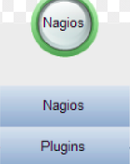
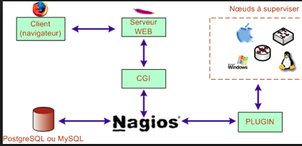

# Tổng quan về nagios 
1. Khái niệm 
- Nagios(Nagios Ain’t Gonna Insist On Sainthood) Là một phần mềm mà nguồn mở miễn phí của máy tính  dùng để giám sát hệ thống, dịch vụ, mạng...
- Nagios cung cấp dịch vụ giám sát và cảnh bảo cho server. Nó thông báo lần một khi gặp sự cố và lần 2 khi sự cố đã được khắc phục 
- Ban đầu nagios được thiết kế để chạy trên linux
- Một chút về lịch sử của nagios: nagios được tạo ra bởi Ethan Galstad và năm 1999 và được biết đến với cái tên `Nestaint`. Đến năm 2002 đã chính thức đổi tên thành nagios. Đến năm 2009 được đổi tên thành `nagios core`
- Các phầm mềm tương tự nagios : Zenoss, Zabbix, Microsoft System Center Manager (SCOM) và SolarWinds; munin 
2. Một số Chức năng nagios cung cấp 
- Giám sát dịch vụ mạng 
- Giám sát tài nguyên máy chủ
- Giám sát phần cứng 
- Giám sát từ xa 
- cung cấp đồ thị dữ liệu 
- cung cấp dịch vụ nagios bằng giao diện web
- Cảnh báo khi xảy ra sự cố thông qua (mail, sms,...)
3. Các phiên bản nagios
- nagios core = nagios 
- Nagios Log Server : Là một phiên bản dùng để quản lý và giám sát nhật ký doanh nghiệp. 
- Nagios Fusion : Khi có nhiều nagios core và nagios XL. fusion được tạo ra để tổng hợp lại tất cả nagios 
- Nagios XI : Là phần mềm giám sát doanh nghiệp 
- Nagios BPI : Dùng để giám sát các quy trình làm việc 
- Nagios Plugins : Được dùng để kiểm tra trạng thái của máy. Nagios sẽ sử dụng kết quả từ plugins để xác định trạng thái của máy.
4. Các khái niệm trong nagios 

4.1 Plugins 

- Plugins nó là một lớp ở giữa nagios và host hay service. Nó sẽ kiểm tra trạng thái của của service hay host và sau đó báo cáo kết quả này lại cho nagios xử lý

4.2 APACHE 
- apache là một phầm mềm của web server. Nó sẽ cung cấp trang web mà ta yêu cầu truy cập. 

4.3 CGI (Common Gateway Interface)
- Hay còn được gọi là chương trình giao diện dòng lệnh. Cung cấp giao thức cho web server 
- Web server thường chuyển thông tin biểu mẫu cho ứng dụng xử lý dữ liệu và có thể gửi lại thông báo xác nhận quá trình đó gọi là CGI

- Ưu điểm của CGI: 
    - Là một tiêu chuẩn rõ ràng và được hỗ trợ 
    - CGI thường được viết bằng C; perl; hoặc shell
    - CGI sử dụng giao diện HTML 
    - Tương thích với các trình duyệt web hiện nay 
    - Viết được bằng tất cả ngôn ngữ 
    - CGI sử dụng mã đã được viết hơn là mã riêng 
    - Nhiều tasks dễ chạy hơn java 
- Nhược điểm
    - Tốn nhiều thời gian xử lý 

4.4 Database 
- Là nơi lưu trữ các loại thông tin của nagios.

5. Cấu trúc của nagios 

- Bao gồm nagios và plugins 

6. Cách thức hoạt động của ngaios 

- Apache : là một phần mềm để sử dụng cho webserver của nagios 
- CGI : là quá trình truyền xử lý yêu cầu của người muốn thực hiện giám sát trạng thái 
- Nagios : Nơi tạo ra yêu cầu và xử lý thông tin trả lại từ plugins 
- Pluins : là nơi giám sát sự thay đổi của thiết bị
- Monitored Elements : Thiết bị yêu cầu giám sát 

# Link tham khảo 
https://en.wikipedia.org/wiki/Nagios

https://searchitoperations.techtarget.com/definition/Nagios

https://networklore.com/nagios/

https://www.nagios.org/about/history/

https://assets.nagios.com/downloads/nagioscore/docs/nagioscore/3/en/plugins.html

https://nsrc.org/workshops/2008/walc/nagios/manual/nagios-3.pdf

https://subscription.packtpub.com/book/application_development/9781783288649/1/ch01lvl1sec12/summary

https://www.nagios.org/projects/nagios-plugins/

https://docplayer.net/1104038-Network-monitoring-using-nagios-as-an-example-tool.html
