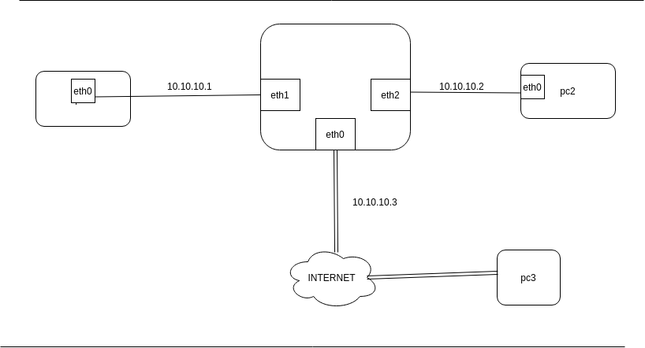
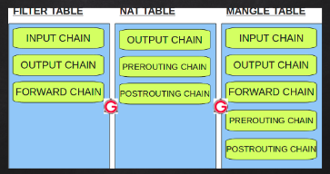

1. Khái niệm 
- Iptable là một loại firewall software hay còn là một loại firewall mềm được sử dụng nhiều trong các phiên bản linux.
- Lịch sử : 
- Được sử dụng để tạo ra một firewall để có thể bảo mật thông tin cá nhân giúp phòng tránh việc mất mát thông tin. Nó có thể lọc các gói tin đi ra và đi vào theo cách mà người sử dụng cài đặt. 

2. so sánh giữa iptable và firewalld 

| Firewalld | Iptables service |
|---|---|
| File lưu cấu hình : /etc/systemconfig/iptables và /etc/systemconfig/ip6tables | Thư mục lưu file xml /etc/firewalld và /usr/lib/firewalld | 
| Khi thêm bớt quy tắc sẽ nhận luôn | Khi thêm bớt quy tắc cần phải reload lại mới nhận |
| Cần phải save vào file nếu ko reload lại sẽ mất | Cần phải sử dụng thêm option để lưu lại ko reload sẽ mất | 

3. Các khái niệm trong IPTABLES 

a) TABLES :  Trong iptables có 3 tables chính 
- NAT : Được dùng để NAT địa chỉ nguồn và địa chỉ đích 
- FILTER : Bảng này quyết định xem gói tin có được đi tiếp hay không. iptables command lấy đây là table mặc định nếu không khai báo rõ table 
- MANGLE : Được sử dụng để thay đổi một số thông tin của 
gói tin
- RAW :  

b) HOOK 
- FORWARD : Nếu gói tin đến không có địa chỉ đích trong local thì nó sẽ được kích hoạt để chuyển đi 
- OUTPUT : Sẽ được sử dụng nếu địa chỉ nguồn là một máy trong local 
- INPUT : Sẽ được sử dụng nếu đích đến là một máy trong local 
- PREROUTING : Được sử dụng trong việc thay đổi địa chỉ đích 
- POSTROUTING : Được sử dụng trong việc thay đổi địa chỉ nguồn 

 

c) Target 

| Target | DESCRIPTION | 
|----|----|
| APCCEPT | Chấp nhận gói tin đi vào local |
| DROP | từ chối gói tin đi vào local |
| QUEUE | Cho gói tin đó vào hàng chờ |
| RETURN | Xử lý gói tin này bằng policy |

d) Rules
- iptables rule bao gồm một hoặc nhiều tiêu chuẩn để xác định packets nào sẽ phải chịu ảnh hưởng và target để xác định hành động nào sẽ được thực thi với packet ấy.

e) Chains
- Table sẽ được tao ra bởi tập hợp các chain 
- Mỗi chain sẽ có một policy riêng (DROP hoặc ACCEPT)
- Mặc định trong table đều có sẵn các chain. 

f) Netfilter 
- Iptables hoạt động bằng cách tương tác với các hook trong kernel để lọc các gói tin. Thì các hook này được gọi là  khung Netfilter 
- Có 5 hook mà người dùng có thể thêm các quy tắc vào. 

4. Cấu trúc của iptables 

 

Iptables được tạo ra từ tập hợp nhiều bảng và trong mỗi bảng được tạo nên bởi các chain. 

Trong mỗi chain này chứa các rules. Rules chính là quy tắc được thêm bớt vào để lọc các gói tin 

5. Cách xử lý một gói tin của iptables 

 

Khi một gói tin đi vào từ internet nó sẽ đi qua các bảng có các hook perrouting Sau đó nó đi đến routing.
- Nếu gói tin đó không thuộc local này thì nó sẽ được đi sang các chain forward của các table và rồi đi đến một mạng local khác. 
- Nếu nó thuộc local này thì nó sẽ được đi đến các chain INPUT. Các chain này sẽ thực hiện quá trình lọc gói tin xem nó có được đi vào bên trong local hay là không. 

Còn một gói tin được đi ra từ local thì nó sẽ đi đến thẳng các chain OUPUT và nếu được phép đi ra ngoài thì gói tin đó sẽ đến quá trình routing rồi đi đến một mạng local khác 