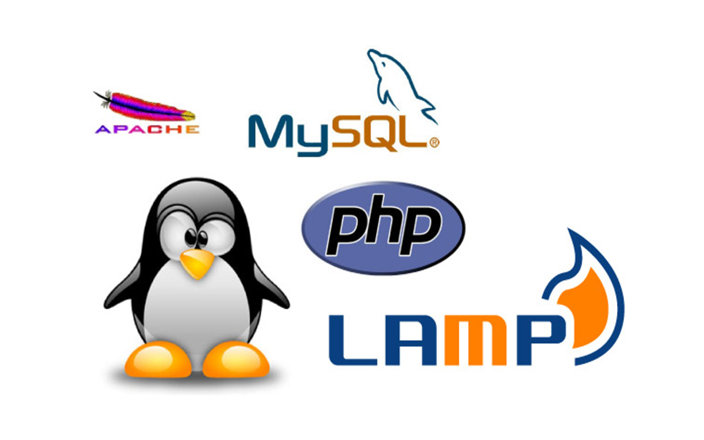
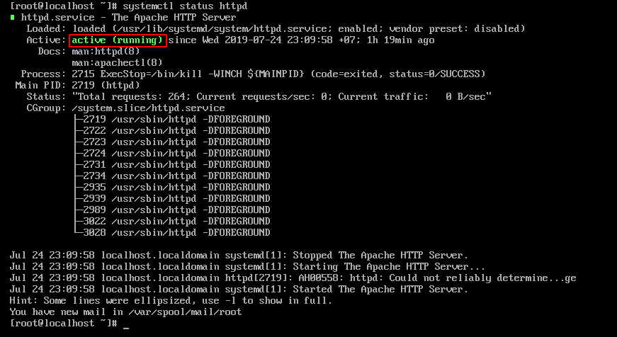
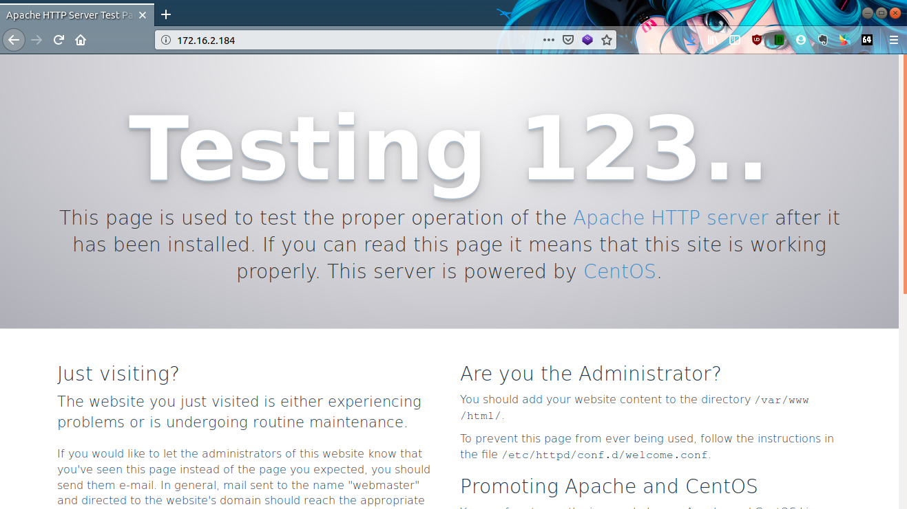
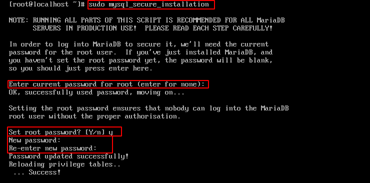
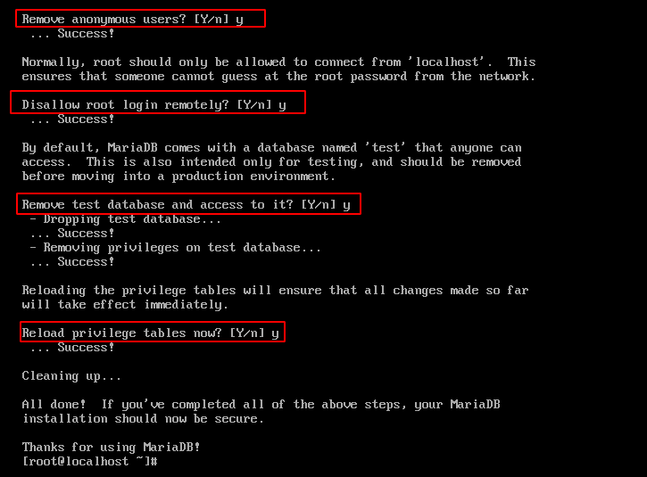
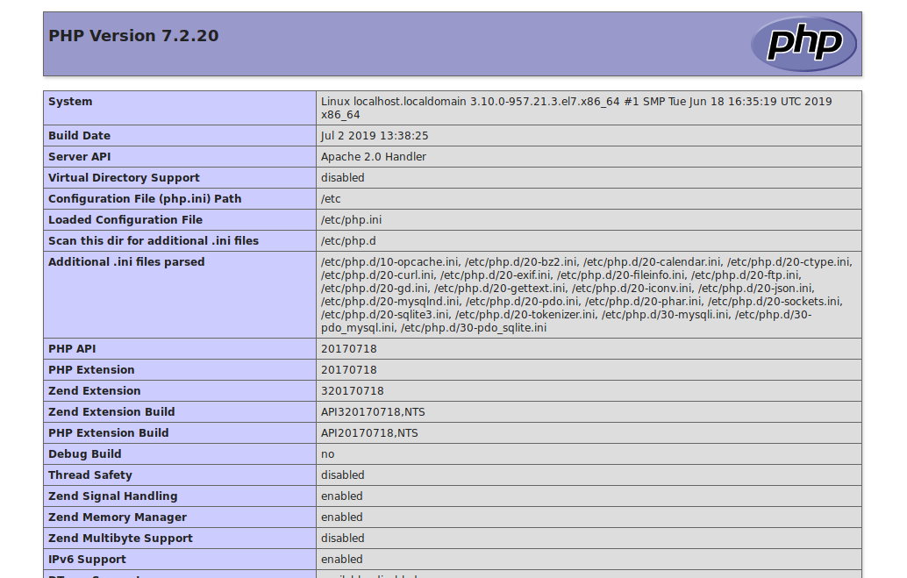

Hướng dẫn cài đặt LAMP
===
## Mục Lục
1. [Tổng quan](#1-Tổng-quan)
2. [Tiến hành cài đặt](#2-tiến-hành-cài-đặt)
3. [Tài liệu tham khảo](#3-tài-liệu-tham-khảo)
## 1. Tổng quan

LAMP là một hệ thống các phần mềm để tạo dựng môi trường máy chủ web có khả năng chứa và phân phối các trang web động được viết bằng PHP.



LAMP bao gồm:
- Linux: là hệ điều hành, cũng là phần mềm dùng để điều phối và quản lí các tài nguyên của hệ thống.
- Apache: là phần mềm máy chủ web, có thể thực hiện các request được gọi tới máy chủ thông qua giao thức HTTP 
- Mysql/Mariadb: là hệ quản trị cơ sở dữ liệu giúp lưu trữ và truy xuất dữ liệu. Cả 2 hệ quản trị cơ sở dữ liệu này đều khá tương đồng với nhau (có thể tìm hiểu thêm tại [đây](https://www.eversql.com/mariadb-vs-mysql/))
- PHP: Là ngôn ngữ lập trình cho kịch bản hoạt động của máy chủ.
## 2. Tiến hành cài đặt

### 2.1. Cài đặt linux

Đối với việc cài đặt hệ điều hành, bạn có thể hiện trên nhiều bản phân phối khác nhau của linux như Debian, Redhat, Ubuntu... Trong bài này, mình sử dụng hệ điều hành CentOS 7.

### 2.2. Cài đặt Apache

Để cài đặt, trên cửa sổ terminal gõ lệnh:
```
$ sudo yum install httpd
```

Cài xong, tiến hành khởi động lại service:

```
$ systemctl start httpd
$ systemctl enable htppd
```

Bạn có thể check lại trang thái hoạt động của service bằng cách gõ:

```
$ systemctl status httpd
```



Bạn cũng có thể kiểm tra trạng thái trên trình duyệt bằng cách gõ trên thanh url địa chỉ sau:
```
<địa chỉ ip server>
```



Nếu bạn sử dụng hệ điều hành trên máy ảo, bạn có thể tắt firewall để có thể truy cập trên browser của máy thực:

```
$ systemctl stop firewalld
```

Sau đó, gõ địa chỉ ip máy ảo trên thanh url cũng sẽ cho ra kết quả tương tự.

### 2.3. Cài đặt hệ quản lí cơ sở dữ liệu

Trên thực tế với LAMP, bạn có thể sử dụng mysql hoặc mariadb đều được, bài này mình sẽ hướng dẫn với mariadb.

Trên cửa sổ terminal, tiến hành cài đặt mariadb:
```
$ sudo yum install mariadb mariadb-server
```

Tiến hành khởi động mariadb service:
```
$ systemctl start mariadb
```

Cài lại mật khẩu mật khẩu cho quyền root của cơ sở dữ liệu:
```
$ sudo mysql_secure_installation
```



Ở bước này ta sẽ thiết lập một số cấu hình như sau:

```
Enter currret password for root (enter for none):
```

Bước này yêu cầu bạn nhập mật khẩu gần đây cho root. Nếu bạn mới cài lần đầu thì nhấn Enter để bỏ qua.

```
Set root password? (Y/n)
```

Nếu bạn cài lần đầu, hệ thống sẽ hỏi bạn muốn cài password cho quyền root không. Bạn gõ **Y -> Enter**, sau đó nhập mật khẩu và xác thực mật khẩu.



Với những máy mới cài mariadb lần đầu, hệ thống yêu cầu thêm một số thiết lập như sau:
- Xoá bỏ các user khác.
- Không cho phép root đăng nhập từ xa.
- Xoá bỏ databases test.
- Khởi chạy lại bảng Privilege (bảng phân quyền).

Bạn chỉ cần gõ **Y** cho những yêu cầu đó.

Sau khi thiết lập xong, kích hoạt mariadb để khởi động cùng hệ thống:
```
$ systemctl enable mariadb
```

### 2.3. Cài đặt php

Phiên bản có sẵn trong repo của CentOS đang là 5.4. Phiên bản này khá cũ và sẽ khiến bạn gặp một số vấn đề xảy ra khi tiến hành cài đặt wordpress. Vì vậy bạn cần phải cài đặt phiên bản 7x để khắc phục. Bạn cần tiến hành thêm kho vào Remi CentOS:
```
$ rpm -Uvh http://rpms.remirepo.net/enterprise/remi-release-7.rpm
```

Cài yum-utils vì chúng ta cần tiện ích yum-config-manager để cài đặt:
```
$ yum -y install yum-utils
```

Tiến hành cài đặt php. Ở đây ta cần lưu ý về phiên bản cài đặt như sau:
- Bản 7.0:
```
$ yum-config-manager --enable remi-php70
$ yum -y install php php-opcache php-mysql
```

- Bản 7.1:
```
$ yum-config-manager --enable remi-php71
$ yum -y install php php-opcache php-mysql
```
- Bản 7.2:
```
$ yum-config-manager --enable remi-php72
$ yum -y install php php-opcache php-mysql
``` 

- Bản 7.3:
```
$ yum-config-manager --enable remi-php73
$ yum -y install php php-opcache php-mysql
```

Trong bài này, mình cài phiên bản 7.2

Sau khi cài đặt xong, thực hiện restart lại apache:

```
systemctl restart httpd
```

Tiến hành kiểm tra kết quả. Ta thêm file sau:

```
echo "<?php phpinfo();?>" > /var/www/html/info.php
```

Sau đó restart lại apache:
```
systemctl restart httpd
```

Vào trình duyệt, gõ trên thanh url địa chỉ sau:

```
<địa chỉ ip>/info.php
```

Khi màn hình này xuất hiện, bạn đã thực hiện thành công!



### 3. Tài liệu tham khảo

1. [Tìm hiểu về LAMP](https://en.wikipedia.org/wiki/LAMP_(software_bundle))

2. [Cài đặt LAMP](https://www.howtoforge.com/tutorial/centos-lamp-server-apache-mysql-php/)
