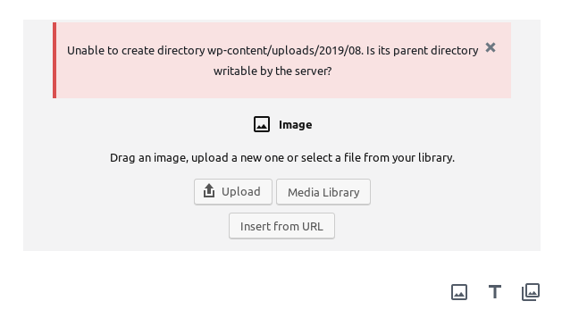

Hướng dẫn tạo bài viết trên Wordpress
===
## Mục lục
1. [Mục đích](#1-Mục-đích)
2. [Cách tạo bài viết đơn giản trên wordpress](#2-Cách-tạo-bài-viết-đơn-giản-trên-wordpress)
3. [Tài liệu tham khảo](#3-Tài-liệu-tham-khảo)
## 1. Mục đích

Trong chuỗi bài viết của mình, mình đã hướng dẫn cách để [cài đặt wordpress trên máy chủ CentOS 7](https://news.cloud365.vn/cai-dat-wordpress-tren-may-centos/#more-450). Bài viết này sẽ hướng dẫn bạn chi tiết cách để tạo một bài viết đơn giản trên chính trang Wordpress của bạn.


## 2. Cách tạo bài viết đơn giản trên wordpress

### Bước 1: Tạo thư mục upload

Khi bạn thực hiện thao tác upload ảnh hay bài viết, sẽ xuất hiện lỗi sau:



Như vậy, bạn cần tiến hành tạo thư mục `uploads` như sau:
```
mkdir -p /var/www/html/wp-content/uploads
```

Thư mục này sẽ có chức năng lưu trữ ảnh và bài viết được đăng.
>Lưu ý: Các thư mục được sắp xếp theo năm và tháng.
### Bước 2: Phân quyền cho thư mục wordpress.

Về cơ bản thì khi cài đặt apache, hệ thống sẽ tự động tạo một user mới có tên là apache. Nhiệm vụ của user này sẽ quản lí các thành phần có liên quan tới dịch vụ máy chủ web (server). Vì vậy, ta cần thay đổi quyền sở hữu thư mục wordpress. Trên của sổ terminal, gõ lệnh:
```
chown -R apache:apache /var/www/html/*
chmod -R 755 /var/www/html/*
```
Điều này sẽ cho phép user apache tạo các thư mục và lưu các tệp tải lên ở đây.

## 3. Tài liệu tham khảo

1. [Hướng dẫn cài đặt wordpress](https://www.rosehosting.com/blog/install-wordpress-on-a-centos-7-vps/)