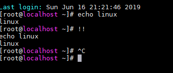

# 101 Commands

I.Di chuyển ,liệt kê các tập tin

1.Sử dụng lệnh trước đó vừa sử dụng
```
!!
```
- Ta thử nó với lệnh echo
```
[root@localhost ~]# echo linux
linux
[root@localhost ~]# !!
echo linux
linux
```


2 .Hiển thị tên thư mục đang làm việc

`pwd`
```
[root@localhost home]# pwd
/home

```
3. Di chuyển qua lại các thư mục
- Di chuyển tới thư mục người dùng ( /home/người_dùng )

`cd`
- Di chuyển tới thư mục home

`cd /`
- Di chuển ra khỏi 1 lớp thư mục (Di chuyển ra thư mục mẹ của thư mục hiện tại.)

`cd ..`
```

[root@localhost /]# cd /home
[root@localhost home]# cd file2
[root@localhost file2]# cd ..
[root@localhost home]#

```
- Di chuyển tới thư mục ( /home/người_dùng/Desktop )

`cd ~`
- Hoán đổi vị trí đứng với thư mục này và thư mục mẹ của nó.

`cd -`
```
[root@localhost home]# cd -
/home/file2
[root@localhost file2]# 
```

4. Liệt kê các danh mục trong thư mục hiện hành

`ls`
```

[root@localhost /]# cd /
[root@localhost /]# ls
bin   dev  home  lib64  mnt  proc  run   srv  tmp  var
boot  etc  lib   media  opt  root  sbin  sys  usr
[root@localhost /]#

```

- Liệt kê danh mục tập tin trong thư mục 1 cách chi tiết.

`ls -l`

Liệt kê tất cả các tập tin, kể cả các tập tin ẩn (thường có tên bắt đầu bằng một dấu chấm)

```
[root@localhost /]# ls -l
total 20
lrwxrwxrwx.   1 root root    7 Jun 11 13:02 bin -> usr/bin
dr-xr-xr-x.   5 root root 4096 Jun 11 13:07 boot
drwxr-xr-x.  20 root root 3220 Jun 16 21:21 dev
drwxr-xr-x.  74 root root 8192 Jun 16 21:21 etc
drwxr-xr-x.   8 root root   82 Jun 16 22:37 home
lrwxrwxrwx.   1 root root    7 Jun 11 13:02 lib -> usr/lib
lrwxrwxrwx.   1 root root    9 Jun 11 13:02 lib64 -> usr/lib64
drwxr-xr-x.   2 root root    6 Apr 11  2018 media
drwxr-xr-x.   2 root root    6 Apr 11  2018 mnt
drwxr-xr-x.   2 root root    6 Apr 11  2018 opt
dr-xr-xr-x. 124 root root    0 Jun 16 21:21 proc
dr-xr-x---.   2 root root  135 Jun 11 13:11 root
drwxr-xr-x.  24 root root  740 Jun 16 21:21 run
lrwxrwxrwx.   1 root root    8 Jun 11 13:02 sbin -> usr/sbin
drwxr-xr-x.   2 root root    6 Apr 11  2018 srv
dr-xr-xr-x.  13 root root    0 Jun 16 21:21 sys
drwxrwxrwt.  17 root root 4096 Jun 16 21:21 tmp
drwxr-xr-x.  13 root root  155 Jun 11 13:02 usr
drwxr-xr-x.  19 root root  267 Jun 11 13:08 var
[root@localhost /]#

```
`ls-a`

- Liệt kê tên các thư mục nằm trong thư mục hiện hành.
```

[root@localhost /]# ls -a
.   bin   dev  home  lib64  mnt  proc  run   srv  tmp  var
..  boot  etc  lib   media  opt  root  sbin  sys  usr
[root@localhost /]#

```
`ls -d`
 - Xếp lại các tập tin theo ngày đã tạo ra, bắt đầu bằng những tập tin mới nhất.

`ls -t`
- Xếp lại các tập tin theo kích thước, từ to nhất đến nhỏ nhất.

`ls -s`
- Liệt kê theo từng trang một, nhờ tiện ích ( more )

### II. Tập tin và thư mục
**1. Lệnh dùng để copy (cp)**

 
`` cp file1 file2``

```
[root@localhost home]# cp file1/a1 file1/a2
cp: overwrite ‘file1/a2’? y
[root@localhost home]# cd file1
[root@localhost file1]# cat a2
day la noi dung
day la noi dung
day la noi dung

[root@localhost file1]#

```
 - Sao chép từ file1 sang file2.


`` cp file thưmục ``

```
[root@localhost file1]# cd ..
[root@localhost home]# cp file1/a1 file2
[root@localhost home]# cd file2
[root@localhost file2]# ls
a1  b1
[root@localhost file2]#

```
- Chép file vào thự mục.


`` cp -i file1 file2``

- kiểm tra xem có ghi đè không.
    


`` cp -f file1 file2 ``
   
   - Sao chép mà không cần xác nhận là có ghi đè hay không.


`` cp -b file1 file2``

- Nếu đích sao chép có cùng tên tệp, tạo bản sao lưu và sao chép.
    


`` cp -r thưmục1 thưmục2 ``
    
- Sao chép tất cả nội dung của ``thưmục1`` sang ``thưmục2``.
```
[root@localhost home]# cd file2
[root@localhost file2]# cp -r a1 b1
cp: overwrite ‘b1’? t
[root@localhost file2]# cp -r a1 b1
cp: overwrite ‘b1’? y
[root@localhost file2]# cat b1
day la noi dun cua a1

[root@localhost file2]#

```

2. Chuyển tên tập tin/ thư mục. mv
