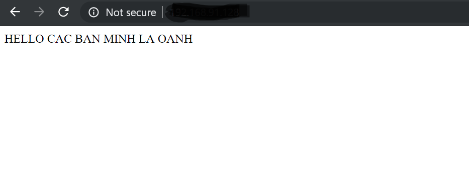

# Server Apache 

- [Khái niệm](#khainiem)
- [Nguyên tắc hoạt động](#hoatdong)
- [Cài đặt Apache](#caidat)
- [Kiểm tra](#kiemtra)

Hiện nay, hầu hết các mã nguồn mở chạy tốt trên Server Apache. Về mặt nào đó Apache không hẳn là web server tốt nhất nhưng chúng lại miễn phí và dễ dàng cài đặt. Cho nên bạn có thể bắt gặp Apache ở bất kỳ nhà cung cấp dịch vụ web hosting nào. Vậy Apache là gì chúng ta sẽ tìm hiểu trong bài này .

<a name ="khainiem"></a>

### 1. Apache là gì

Apache tên chính thức là `Apache HTTP Server ` đây là một phần mềm web server miễn phí có mã nguồn mở. Một sản phẩm được phát triển và điều hành bởi hệ thống `Apache Software Foundation`. Và đây cũng một trong những web server được sử dụng phổ biến nhất hiện nay.

Apache Web Server chạy trên chính phần mềm của mình chứ không phải là server vật lý.Với nhiệm vụ chủ yếu là thiết lập kết nối, liên kết giữa server và browser rồi chuyển file giữa chúng (cấu trúc hai chiều client - server).
Các bạn có thể tìm hiểu thông tin của mô hình client server [tại đây](../docs/Client-Server.md)

<a name="hoatdong"></a>

### 2. Nguyên tắc hoạt động 

Công việc của nó là thiết lập kết nối giữa server và trình duyệt người dùng (Firefox, Google Chrome, Safari, .....) rồi chuyển file tới và lui giữa chúng (cấu trúc 2 chiều dạng client-server)

Ví dụ khi bạn muốn tải một trang web trên website  `news.cloud365` chẳng hạn.Trình duyệt người dùng sẽ gửi yêu cầu tải trang web đó lên server và Apache sẽ trả kết quả với tất cả đầy đủ các file cấu thành nên trang News.cloud365 (hình ảnh, chữ, vâng vâng). Server và client giao tiếp với nhau qua giao thức HTTP và Apache chịu trách nhiệm cho việc đảm bảo tiến trình này diễn ra mượt mà và bảo mật giữa 2 máy.

<a name="caidat"></a>

### 3. Cài đặt Apache trên CentOS7 

**HTTPD :** là chương trình máy chủ Giao thức truyền văn bản siêu văn bản (HTTP) của Apache. Nó được thiết kế để được chạy dưới dạng tiến trình độc lập.Khi được sử dụng như thế này, nó sẽ tạo ra một nhóm các tiến trình con hoặc các luồng để xử lý các yêu cầu.


Bước 1. Cài đặt repo `Epel` 

```
yum install -y epel-release

```
Bước 2. Vài đặt gói httpd

```
yum install -y httpd

```
Bước 3. Cấu hình firewalld cho phép dịch vụ httpd 

```
firewall-cmd --zone=public --permanent --add-service=http
firewall-cmd --reload
```
Bước 4. Khởi động dịch vụ httpd và cấu hình tự khởi động sau khi boot.

```
 systemctl start httpd
 systemctl enable httpd

```
Bước 5. Kiểm tra trạng thái hoạt động của httpd 

Dùng câu lệnh `systemctl status httpd` 


Như trong hình trên ta có thể thấy là httpd đag trong trạng thái  `running`.

<a name="kiemtra"></a>

### 4. Kiểm tra 

Kiểm tra xem Apache có đang LISTEN các kết nối đến port 80 hay không

```
netstat -tulpn 
```


Thử tạo một file HTML trong thư mục `/var/www/html` (là thư mục mặc định của Web Apache) để kiểm tra xem dịch vụ Apache đã chạy là thực hiện được các request chưa 

```
cd /var/html 
vi index.html 
<p1> HELLO CAC BAN MINH LA OANH </p1>
```
Tiếp theo bạn truy cập địa chỉ ip local cùng lớp mạng để kiểm tra.




Tài liệu tham khảo :
- https://www.hostinger.vn/huong-dan/apache-la-gi-giai-thich-cho-nguoi-moi-bat-dau-hieu-ve-apache-web-server/#Apache-Web-Server-hoat-dong-nhu-the-nao

- https://news.cloud365.vn/apache-tong-quan-ve-dich-vu-apache/#more-931


